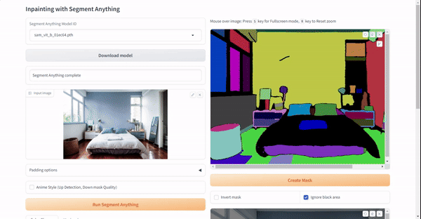

# Project Overview
This project leverages the Segment Anything Model (SAM) for image segmentation, allowing users to identify and segment specific regions within an image. The application provides a user-friendly interface for selecting and customizing segmented areas by applying a custom logic to change their colors. SAM's high-quality segmentation forms the foundation for targeted color adjustments, providing users with a powerful tool for creative image editing.

## Key Features:

1. SAM Image Segmentation:

  - Utilizes the Segment Anything Model for accurate and detailed image segmentation.
  - High-quality segmentation enables precise identification of objects and regions within an image.

2. Color Customization:

  - Allows users to select segmented areas and apply custom logic to change their colors.
  - Provides a flexible and intuitive interface for users to define their own color adjustment rules.

3. User-Friendly Interface:

  - Offers an easy-to-use web interface for interacting with the application.
  - Supports drag-and-drop functionality for uploading images.

4. Segmentation Area Selection:

  - Enables users to choose specific segmented areas for color customization.
  - Provides tools for adjusting, expanding, and trimming the selected segmentation mask.

5. Color Logic Application:

  - Applies custom logic to alter the colors of the selected segmented areas.
  - Offers options for color picking, hex value input, and other color customization features.

6. Fullscreen and Zoom Options:

  - Enhances the user experience with fullscreen and zoom functionalities for detailed inspection of segmented areas.

7. Option for Offline Processing:

  - Includes an option for offline processing, allowing users to execute inpainting using an offline network.

8. Save Segmentation Image:

  - Provides the option to save the segmentation image generated by SAM for reference or further analysis.

# Use Cases

1. **Creative Image Editing**

- Scenario: A graphic designer working on a digital artwork wants to segment specific elements within an image, such as objects or characters. Using this application, the designer can leverage SAM for accurate segmentation and then apply custom color adjustments to enhance or modify the appearance of the segmented areas. This allows for creative and personalized image editing.

2. **Product Image Customization**

- Scenario: An e-commerce business is preparing product images for an online catalog. The business wants to highlight specific features of each product by changing the colors of segmented areas. With this application, the marketing team can easily select and customize the colors of product details, improving visual appeal and product presentation.

3. **Artistic Photo Manipulation**

- Scenario: A photographer wants to experiment with artistic photo manipulation techniques. The photographer uses SAM to segment various elements in a photograph, such as the sky, trees, and foreground. By applying custom color adjustments, the photographer creates a unique and visually striking composition, showcasing their artistic vision.

4. **Color Correction in Medical Imaging**

- Scenario: In medical imaging, certain segmented regions in an image may require specific color adjustments for better visualization or analysis. Medical professionals can use this application to select and customize the colors of segmented areas in medical images, aiding in accurate diagnosis and analysis.

5. **Educational Material Enhancement**

- Scenario: Teachers or content creators working on educational materials, such as presentations or illustrations, may need to emphasize specific regions in images. This application allows them to segment relevant areas and apply color adjustments to create visually engaging and informative educational content.

This project's versatility makes it applicable across various domains, including graphic design, e-commerce, photography, healthcare, and education. Users can benefit from the combination of SAM's segmentation capabilities and the ability to customize colors based on their specific requirements.

## Running the application

```bash
python iasam_app.py
```

* Open http://127.0.0.1:7860/ in your browser.
* Note: If you have a privacy protection extension enabled in your web browser, such as DuckDuckGo, you may not be able to retrieve the mask from your sketch.

## Quick Demo



### Options

* `--save-seg`: Save the segmentation image generated by SAM.
* `--offline`: Execute inpainting using an offline network.
* `--sam-cpu`: Perform the Segment Anything operation on CPU.

## Downloading the Model

* Launch this application.
* Click on the `Download model` button, located next to the [Segment Anything Model ID](https://github.com/facebookresearch/segment-anything#model-checkpoints). This includes the [Segment Anything in High Quality Model ID](https://github.com/SysCV/sam-hq), [Fast Segment Anything](https://github.com/CASIA-IVA-Lab/FastSAM), and [Faster Segment Anything (MobileSAM)](https://github.com/ChaoningZhang/MobileSAM).
  * Please note that the SAM is available in three sizes: Base, Large, and Huge. Remember, larger sizes consume more VRAM.
* Wait for the download to complete.
* The downloaded model file will be stored in the `models` directory of this application's repository.

## Usage

* Drag and drop your image onto the input image area.
  * Outpainting can be achieved by the `Padding options`, configuring the scale and balance, and then clicking on the `Run Padding` button.
  * The `Anime Style` checkbox enhances segmentation mask detection, particularly in anime style images, at the expense of a slight reduction in mask quality.
* Click on the `Run Segment Anything` button.
* Use sketching to point the area you want to inpaint. You can undo and adjust the pen size.
  * Hover over either the SAM image or the mask image and press the `S` key for Fullscreen mode, or the `R` key to Reset zoom.
* Click on the `Create mask` button. The mask will appear in the selected mask image area.

### Mask Adjustment

* `Expand mask region` button: Use this to slightly expand the area of the mask for broader coverage.
* `Trim mask by sketch` button: Clicking this will exclude the sketched area from the mask.
* `Add mask by sketch` button: Clicking this will add the sketched area to the mask.

### Color Change
* `Color` button: Use this pick a color from hexvalues to change the color of selected mask.

### Contact us

* Please don't hesitate to contact us if you have any issues with the code or if you have any other remarks or questions.
* We are always open for a collaboration with you.